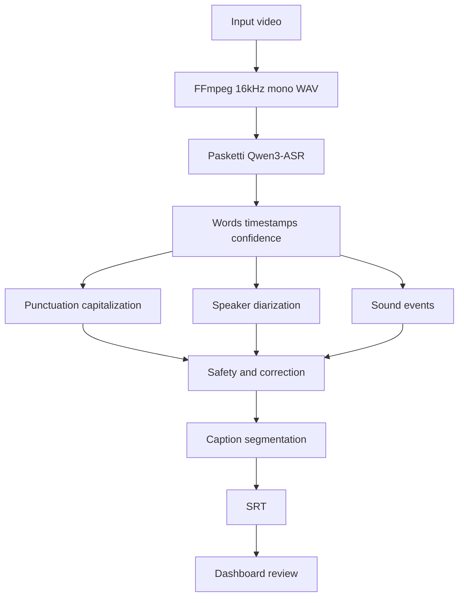

# Implementation plan

This document maps [README.md](../README.md) onto Make targets. Run `make help` from the repo root. The pipeline flowchart lives in [flowchart.md](../flowchart.md).

Application code (`app/`, `dashboard/`, `tests/`) is not in the tree yet. Step targets echo the intended work and fail with `Not implemented yet` until the listed module exists.

## Goal

Build an end-to-end system that takes a children's/family video and produces a high-quality, child-appropriate UTF-8 `.srt`. The first ASR backend is the DrivenData "On Top of Pasketti" Word Track 1st-place model (Qwen3-ASR-1.7B checkpoint). The rest of the system must not be hard-coded to Qwen.

Priorities: children's-speech accuracy, noise robustness, word-level timestamps, child-appropriate captions, context-aware correction, human review of uncertain captions, valid SRT, and a simple creator dashboard.

## Non-goals (first milestone)

- Do not reproduce the Pasketti training pipeline. Use the released checkpoint for inference.
- Do not assume CUDA. Target Apple Silicon (MPS when supported, CPU fallback). Architecture should later allow NVIDIA without changing application logic.
- Do not require the dashboard to run the pipeline. CLI must produce an SRT alone.
- Do not over-engineer Phase 1. Get `video.mp4 → video.srt` working on Apple Silicon before diarization, sound events, contextual correction, or the dashboard.

## Architecture

```text
VIDEO
→ AUDIO EXTRACTION
→ AUDIO PREPROCESSING
→ CHILD-FOCUSED ASR
→ WORD-LEVEL TIMESTAMPS
→ CONFIDENCE ESTIMATION
→ PUNCTUATION/CAPITALIZATION
→ SPEAKER DETECTION          (optional)
→ SOUND EVENT DETECTION      (optional)
→ PROFANITY DETECTION
→ CONTEXTUAL CORRECTION
→ ALLOWLIST/CUSTOM VOCABULARY
→ SAFETY DECISION
→ CAPTION SEGMENTATION
→ SRT GENERATION
→ DASHBOARD REVIEW           (optional)
→ FINAL SRT EXPORT
```

Each stage is a separate Python module. The ASR backend is replaceable via a model registry (`pasketti_first`, later `pasketti_second`, `future_child_asr`).



## How to use Make

```bash
make help                 # list targets
make setup                # dirs, FFmpeg check, device print
make phase1               # core ASR path (fails until modules exist)
make pipeline VIDEO=path.mp4
make test
```

Phase aggregators depend on their step targets. Optional stages must remain skippable (`ENABLE_DIARIZATION=0`, `ENABLE_SOUND_EVENTS=0`) so the core pipeline still runs.

Suggested order: get `make phase1` green on Apple Silicon, then Phases 2–6 independently.

---

## Phase 1 — Core ASR

Milestone: `video.mp4 → video.srt` on Apple Silicon.

Aggregator: `make phase1`

| Target | README | Modules to add later | Artifacts | Acceptance |
|---|---|---|---|---|
| `setup` | §40.1, §4, §33 | `app/config.py`, `requirements.txt` | `data/`, `outputs/`, `models/`, `.env` from `.env.example` | FFmpeg present; device printed; no CUDA crash |
| `extract-audio` | §5–6 | `app/pipeline/audio.py` | `audio.wav` (16 kHz mono PCM); original video unchanged | Sample rate and channel count validated |
| `asr` | §7, §33–35 | `app/models/base.py`, `app/models/pasketti.py`, `app/models/registry.py`, `app/pipeline/asr.py` | `raw_transcript.json` | `ASR_MODEL=pasketti_first`, `DEVICE=auto`; reports MPS or CPU |
| `timestamps` | §8 | `app/pipeline/timestamps.py` | `word_timestamps.json` | Words as `{word, start, end, confidence}`; not converted to SRT yet |
| `srt` | §22 | `app/pipeline/srt.py` | `final.srt` | Valid UTF-8 SRT numbering and timestamps |
| `cli` | §22, §31–32 | `app/pipeline/orchestrator.py`, `python -m app.pipeline` | same as pipeline run | Dashboard not required |
| `check-device` | §33 | `app/config.py` | stdout | Prints Device / Backend / ASR model; CPU fallback warnings |
| `test-phase1` | §36 audio + SRT | `tests/` | pytest output | Extraction, sample rate, mono, valid SRT |

`make cli` and `make pipeline VIDEO=...` are the developer entry points. Intermediate JSON must be kept so later stages can use `--skip-asr`.

---

## Phase 2 — Caption quality

Aggregator: `make phase2`

| Target | README | Modules to add later | Artifacts | Acceptance |
|---|---|---|---|---|
| `confidence` | §9 | `app/pipeline/confidence.py` | `confidence.json` | Scores 0–1; high/medium/low thresholds configurable |
| `punctuation` | §10 | `app/pipeline/punctuation.py` | punctuated transcript; raw ASR preserved | Readable sentences; words not rewritten unnecessarily |
| `segmentation` | §19 | `app/pipeline/segmentation.py` | `final_captions.json` | Line length, pauses, speaker changes, min/max duration |
| `reading-speed` | §20 | `app/pipeline/segmentation.py` | flags on dense captions | CPS/WPS; split, extend, or flag for review |
| `validate-timestamps` | §21 | `app/pipeline/srt.py` | repaired SRT or flags | Increasing, non-negative, in-video, no empty cues |
| `test-phase2` | §36 timestamps + segmentation | `tests/` | pytest output | Overlaps, line length, sentence boundaries, reading speed |

---

## Phase 3 — Child safety

Aggregator: `make phase3`

Never silently make aggressive corrections when confidence is low. Never claim captions are guaranteed safe. Store original transcription always.

| Target | README | Modules to add later | Artifacts | Acceptance |
|---|---|---|---|---|
| `profanity` | §12 | `app/pipeline/profanity.py` | `safety_analysis.json` | Word- and phrase-level; no substring false positives |
| `allowlist` | §13 | configurable list, not hard-coded | allowlist applied | Creator-specific; `bass`, `class`, etc. not censored by default |
| `correction` | §14 | `app/pipeline/correction.py` | `corrected_transcript.json`; correction log | Context window, phonetic similarity, vocabulary, LM likelihood |
| `safety-policy` | §15–16 | `app/config.py` | decisions: keep / replace / `_` / flag | Safe vs literal/review mode; unresolved → `_` or human review |
| `test-phase3` | §36 profanity + correction | `tests/` | pytest output | Exact/phrase/false positive/allowlist; safe vs uncertain cases |

Safety decision cases:

- A — clearly legitimate → keep
- B — likely ASR error with strong alternative → replace
- C — probable profanity, uncertain correction → `_`
- D — uncertain whether profane → flag for review

---

## Phase 4 — Advanced captions

Aggregator: `make phase4`

Optional: the pipeline must run with these disabled.

| Target | README | Modules to add later | Artifacts | Acceptance |
|---|---|---|---|---|
| `diarization` | §17 | `app/pipeline/diarization.py` | `speaker_segments.json` | Speaker 1/2/…; rename in dashboard; not required for basic path |
| `sound-events` | §18 | `app/pipeline/sound_events.py` | `sound_events.json` | `[laughter]`, `[music]`, etc. only above threshold; no hallucination |
| `vocabulary` | §11, §25 | `app/pipeline/vocabulary.py` | vocab lists | Names, toys, phrases; boosting if ASR supports it, else post-process |
| `test-phase4` | §36 + speaker/sound | `tests/` | pytest output | Speaker changes affect segmentation; events use square brackets |

---

## Phase 5 — Dashboard

Aggregator: `make phase5`

The dashboard is a frontend for the pipeline, not the pipeline itself.

```text
UPLOAD → QUEUED → EXTRACTING_AUDIO → TRANSCRIBING → ALIGNING
→ PUNCTUATING → DETECTING_SPEAKERS → DETECTING_SOUNDS
→ SAFETY_ANALYSIS → CORRECTING → SEGMENTING → GENERATING_SRT
→ READY_FOR_REVIEW → REVIEWED → EXPORTED
```

| Target | README | Modules to add later | Artifacts | Acceptance |
|---|---|---|---|---|
| `api` | §5, §24, §28 | `app/main.py`, `app/api/upload.py`, `jobs.py`, `captions.py`, `settings.py`, `app/database/` | job IDs, status | Upload `.mp4`/`.mov`/`.mkv`; one job at a time on Mac prototype |
| `dashboard` | §23–26 | `dashboard/` | UI | Player, timeline, editor, confidence colors, safety review, vocab, settings |
| `export` | §27 | API + UI | reviewed SRT, raw ASR SRT, correction report | Original transcription always recoverable |

---

## Phase 6 — Evaluation

Aggregator: `make phase6`

Do not assume competition ranking equals YouTube children's-content quality.

| Target | README | Modules to add later | Artifacts | Acceptance |
|---|---|---|---|---|
| `evaluate` | §37 | `evaluate.py` | metric report | WER, CER, timestamp accuracy, low-confidence rate, profanity FP/FN, correction accuracy, censorship rate, reading speed |
| `ablation` | §38 | same + pipeline flags | per-config metrics | ASR only; +punctuation; +profanity; +correction; full pipeline |

---

## Cross-cutting targets

| Target | Purpose |
|---|---|
| `help` | Default. Lists targets; points at this file. |
| `pipeline` | `python -m app.pipeline $(VIDEO)`; supports `--skip-asr` when artifacts exist. |
| `test` | All `test-phase*`. |
| `all` | Phases 1–6. Will fail until implemented. |

Every job should later persist: config, ASR model version and checksum, device, timing, pipeline version, safety config, vocabulary, corrections, censoring decisions. Never overwrite raw outputs.

### Intermediate artifacts (README §30)

```text
audio.wav
raw_transcript.json
word_timestamps.json
confidence.json
speaker_segments.json
sound_events.json
safety_analysis.json
corrected_transcript.json
final_captions.json
final.srt
```

---

## Definition of done

From README §42. Automatic captions must still require creator review.

| # | Criterion | Target |
|---|---|---|
| 1 | Open the dashboard | `dashboard` |
| 2 | Upload a children's video | `api` |
| 3 | Wait for processing | `api` / `pipeline` |
| 4 | Video and captions synchronized | `dashboard` |
| 5 | See low-confidence captions | `confidence`, `dashboard` |
| 6 | See potentially unsafe words flagged | `profanity`, `dashboard` |
| 7 | Accept/reject contextual corrections | `correction`, `dashboard` |
| 8 | Edit captions manually | `dashboard` |
| 9 | Add custom vocabulary | `vocabulary`, `dashboard` |
| 10 | Review speaker labels if enabled | `diarization` |
| 11 | Review detected sound events | `sound-events` |
| 12 | Export valid UTF-8 `.srt` | `export`, `srt` |
| 13 | SRT suitable for YouTube Studio | `validate-timestamps`, `export` |
| — | Same path via CLI without dashboard | `cli`, `pipeline` |

Phase 1 is successful when `make pipeline VIDEO=clip.mp4` writes a valid SRT. The project is successful when the table above is true.
